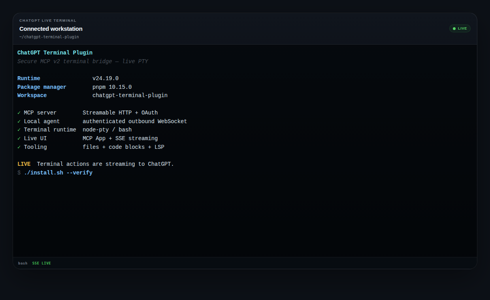

# ChatGPT Terminal Plugin

A production-oriented **MCP v2 terminal bridge for ChatGPT**. It connects an authenticated ChatGPT session to an enrolled computer, runs a real persistent PTY on that computer, streams terminal output into an MCP App UI, and exposes bounded terminal, file, code-execution, raw LSP, and Serena-style semantic code-intelligence tools to the model.

The public server is a control plane. **Commands execute on the local agent, not on the MCP server.**

<p align="center">
  
</p>

> The screenshot above uses the production Terminal UI styling and output captured from a live PTY action through this plugin.

## Highlights

- **Real persistent PTY** — shell state, working directory, environment, and foreground processes persist for the life of a terminal session.
- **ChatGPT-native live UI** — a static-first MCP App renders terminal output in the conversation while the model reads the same session through bounded MCP cursors.
- **Local execution** — `node-pty`, file operations, code blocks, and language servers run on the enrolled computer.
- **Outbound agent connection** — local machines connect to the public gateway over authenticated WebSocket; no inbound SSH port is required on the workstation.
- **Strong device identity** — per-device Ed25519 keys, expiring challenge-response authentication, replay protection, enrollment, rotation, and revocation.
- **Least-privilege profiles** — `read-only`, `developer`, and `owner-full`, enforced independently by server and agent.
- **Structured developer tools** — bounded file read/list/write/search, allowlisted code-block execution, transcripts, session metrics, raw LSP JSON-RPC, and Serena-style symbol/reference/definition/implementation/diagnostic queries.
- **Streaming safety** — monotonic event sequences, ACK/backpressure, reconnect/resume, duplicate suppression, bounded buffers, and short-lived UI stream capabilities.
- **Production deployment assets** — Caddy, systemd, server/agent environment templates, health checks, audit logging, and E2E coverage.
- **One-command bootstrap** — `./install.sh` installs, builds, and verifies the monorepo.

## How it works

```text
ChatGPT / MCP client
        |
        | OAuth bearer + MCP Streamable HTTP
        v
+-------------------------------+
| Public MCP server             |
|                               |
|  MCP tools + authorization    |
|  session / event control      |
|  audit + transcripts          |
|  short-lived SSE capability   |
+---------------+---------------+
                |
                | authenticated WebSocket
                | Ed25519 challenge-response
                v
+-------------------------------+
| Local terminal agent          |
|                               |
|  node-pty                     |
|  file tools                   |
|  code-block executor          |
|  LSP processes                |
+---------------+---------------+
                |
                v
        bash / zsh / configured shell

Public MCP server ---- short-lived SSE ----> MCP App Terminal UI
ChatGPT model    ---- terminal_read -------> bounded terminal events
```

There are deliberately **two output paths**:

1. `terminal_read` is authoritative model context. Reads are bounded by bytes and monotonic cursors.
2. The MCP App receives a short-lived, session-bound SSE capability for low-latency display. The browser widget never receives the user's primary MCP OAuth bearer token.

## Repository layout

```text
chatgpt-terminal-plugin/
├── packages/
│   ├── mcp-server/      # public MCP backend, OAuth/JWT, gateway, SSE, audit
│   ├── local-agent/     # local PTY, files, code execution, LSP, device identity
│   ├── protocol/        # shared Zod schemas and gateway/event protocol
│   └── terminal-ui/     # static-first MCP App Terminal UI v13
├── tests/
│   ├── unit/            # security, lifecycle, UI, process and installer tests
│   └── e2e/             # real MCP client -> server -> signed agent -> real PTY
├── deploy/              # Caddy, systemd and environment examples
├── docs/                # architecture, protocol, security and deployment docs
└── install.sh           # one-command bootstrap and verification
```

## Requirements

- **Node.js 22+**
- The repository-declared pnpm release (`pnpm@10.15.0` currently)
- A supported local shell
- Native build prerequisites required by `node-pty` on the target OS
- For production: a public HTTPS/WSS origin and an OAuth-compatible identity layer

Linux and macOS commonly use `bash` or `zsh`. Windows agents can be configured for an appropriate PowerShell or WSL shell.

## Quick start

```bash
git clone https://github.com/heidi-dang/chatgpt-terminal-plugin.git
cd chatgpt-terminal-plugin
./install.sh
```

That command:

1. verifies Node.js and the repository package-manager declaration;
2. installs the frozen pnpm dependency graph;
3. runs TypeScript and ESLint checks;
4. runs the unit suite;
5. builds the protocol, MCP server, local agent, and Terminal UI;
6. enforces the Terminal UI bundle budget; and
7. runs the real-PTY MCP E2E suite.

### Installer modes

| Command | Use case |
| --- | --- |
| `./install.sh` | Clean/reproducible install plus the complete verification gate. |
| `./install.sh --dev` | Developer bootstrap; skips the slower E2E suite. |
| `./install.sh --verify` | Re-run the complete quality gate without reinstalling dependencies. |
| `./install.sh --skip-tests` | Install/build/static checks without unit or E2E test suites. |
| `./install.sh --help` | Show installer usage. |

The installer is idempotent and reads the required pnpm version from `package.json`; it does not hardcode workstation-specific directories or credentials.

## Local development

Use `deploy/server-environment.example` and `deploy/local-agent-environment.example` as references, but keep real credentials in your shell, secret manager, or owner-only environment files outside Git. The runtime reads `process.env` directly; it does **not** implicitly load those example files.

After exporting the development server and agent variables into the current shell, start all three development processes with:

```bash
pnpm dev
```

The root development command runs the MCP server, local agent, and Terminal UI together and inherits the current shell environment.

For a first local agent enrollment, configure the gateway/enrollment URL, owner identity, bootstrap token, execution profile, allowed workspace roots, and identity path. After enrollment succeeds, remove the bootstrap enrollment token from the persistent agent environment.

## Production deployment

Production has two independently deployed roles:

### 1. Public MCP server

Deploy the repository to a server with a public HTTPS origin and configure it from `deploy/server-environment.example`.

At minimum, production requires:

- `NODE_ENV=production`
- `MCP_PUBLIC_URL=https://<your-origin>/mcp`
- a supported authentication mode and its issuer/JWKS/audience values
- `STREAM_TOKEN_SECRET`
- `AGENT_DEVICE_REGISTRY_PATH`
- `AGENT_ENROLLMENT_TOKEN`
- protected audit/transcript locations

Build and verify the release with:

```bash
./install.sh
```

Then run the server using the provided systemd baseline:

```text
deploy/systemd/chatgpt-terminal-mcp.service.example
```

`deploy/Caddyfile.example` demonstrates HTTPS termination, MCP HTTP proxying, WebSocket upgrades, and streaming-friendly proxy behavior.

### 2. Local terminal agent

On each computer ChatGPT should be allowed to control, install the same release and configure `deploy/local-agent-environment.example`.

Important values include:

```text
AGENT_GATEWAY_URL=wss://<your-origin>/agent
AGENT_IDENTITY_PATH=<owner-only device identity file>
EXECUTION_PROFILE=developer
ALLOWED_WORKSPACE_ROOTS=<comma-separated workspace roots>
```

First enrollment also requires:

```text
AGENT_ENROLLMENT_URL=https://<your-origin>/agent/enroll
AGENT_OWNER_ID=<validated MCP user identity>
AGENT_ENROLLMENT_TOKEN=<bootstrap enrollment secret>
```

Run the local agent as the OS user whose workspaces and developer tools it is intentionally allowed to access. **Do not run the agent as root.**

A user-service baseline is provided at:

```text
deploy/systemd/chatgpt-terminal-agent.service.example
```

After enrollment, the agent authenticates with its local Ed25519 private key. The bootstrap enrollment token is not needed for normal gateway connections.

### 3. Connect ChatGPT

Expose the MCP endpoint at your configured HTTPS URL, for example:

```text
https://<your-origin>/mcp
```

Complete the OAuth flow in ChatGPT and allow the connector to initialize. An enrolled local agent should then appear through `terminal_list_agents`, after which ChatGPT can open a terminal surface and start a PTY on that selected computer.

For the complete authentication, reverse-proxy, enrollment, smoke-test, upgrade, and rollback procedure, read **[`docs/deployment.md`](docs/deployment.md)**.

## MCP capabilities

### Terminal lifecycle

| Tool | Purpose |
| --- | --- |
| `terminal_surface` | Open the single Terminal UI surface for the current assistant turn. |
| `terminal_list_agents` | List enrolled online computers visible to the authenticated user. |
| `terminal_start` | Start a fresh persistent PTY on a selected agent. |
| `terminal_read` | Read bounded sequenced terminal events after a cursor. |
| `terminal_write` | Send terminal input or commands. |
| `terminal_resize` | Resize the PTY. |
| `terminal_interrupt` | Send Ctrl+C/SIGINT to the foreground process. |
| `terminal_status` | Read session, agent, uptime, event, output-byte, and command counters. |
| `terminal_session_transcript` | Read a bounded structured chronological transcript. |
| `terminal_close` | Terminate and dispose the PTY. |
| `terminal_turn_close` | Tear down the active PTY and Terminal UI at end of turn. |
| `terminal_continue_task` | Return a current-turn continuation checkpoint for already-approved work; it does not schedule background re-entry or bypass authorization. |

### Files, code, and language intelligence

| Tool | Purpose |
| --- | --- |
| `terminal_read_file` | Bounded UTF-8 file reads under the session workspace policy. |
| `terminal_list_files` | Bounded directory listing without following symlink metadata. |
| `terminal_write_file` | Bounded writes with canonical parent and symlink checks. |
| `terminal_search_files` | Bounded regex search with file/result limits. |
| `terminal_execute_code_block` | Run allowlisted `bash`, `python3`, `node`, or `typescript` code with bounded MCP output excerpts and explicit truncation metadata. |
| `terminal_cancel_code` | Cancel an owned running code execution. |
| `terminal_semantic_open` | Open an initialized Serena-style semantic workspace on an administrator-configured language server. |
| `terminal_semantic_symbols` | Return structured symbols for a synchronized source file. |
| `terminal_semantic_find_symbols` | Search workspace symbols through language-server indexing. |
| `terminal_semantic_references` | Find semantic references at a source position. |
| `terminal_semantic_definition` | Resolve a symbol definition/declaration. |
| `terminal_semantic_implementations` | Resolve semantic implementations. |
| `terminal_semantic_diagnostics` | Return the latest synchronized language-server diagnostics for a file. |
| `terminal_semantic_preview_edit` | Preview digest-guarded rename/replace/insert/safe-delete refactors without writing. |
| `terminal_semantic_apply_edit` | Apply one preview; rejects stale workspace revisions. |
| `terminal_semantic_project_overview` | Inspect bounded Serena-style project onboarding metadata. |
| `terminal_semantic_memory_read` | Read a named bounded project memory. |
| `terminal_semantic_memory_write` | Persist a named project memory in local-agent state. |
| `terminal_semantic_close` | Close an owned semantic workspace and its language-server process. |
| `terminal_lsp_start` | Start an administrator-configured language server for advanced raw JSON-RPC use. |
| `terminal_lsp_request` | Send a bounded ownership-checked raw LSP JSON-RPC request. |
| `terminal_lsp_stop` | Stop an owned raw language-server process. |

The MCP App also uses restricted application-facing lifecycle/stream operations to refresh short-lived terminal stream capabilities and synchronize the active surface.

### Serena-style semantic code intelligence

The semantic tools are a native TypeScript integration inspired by Serena's high-level code-navigation model; they do **not** embed Serena's Python runtime or replace the terminal transport. `terminal_semantic_open` performs the LSP `initialize`/`initialized` handshake and creates a per-user semantic workspace. File-based semantic operations synchronize the current filesystem contents with `didOpen`/full-text `didChange`, so edits made through the shell, Git, formatters, or other tools are reflected before the next query.

Semantic mutations use preview/apply semantics: previews return bounded diffs plus SHA-256 file revisions, and apply fails with `STALE_EDIT` if any affected file changed. Rename uses LSP `textDocument/rename`; replace/insert/safe-delete operate on enclosing semantic symbol ranges, with safe-delete refusing live references. Project overview and named project memory complete the Serena-style onboarding workflow.

Semantic output is bounded to 200 top-level results and 64 KiB of serialized result data, with `truncated=true` when the result is shortened. `textDocument/publishDiagnostics` notifications are cached only for files inside the authorized workspace root. Safe server-to-client requests required by common language servers (`workspace/configuration`, `workspace/workspaceFolders`, and work-done progress creation) are handled explicitly; server-driven edits and all other unapproved requests remain fail-closed.

The fixed semantic read surface is available to the `read-only` execution profile because it cannot select arbitrary LSP methods. The lower-level `terminal_lsp_*` surface remains separately authorization-gated for advanced use. See [`docs/semantic-code-intelligence.md`](docs/semantic-code-intelligence.md).

## Execution profiles

The authenticated server identity and local agent each impose an execution profile. The effective permission is the **more restrictive** of the two.

| Profile | Behavior |
| --- | --- |
| `read-only` | Discovery/read/status operations only; PTY creation and mutations are rejected. |
| `developer` | PTY launch and direct file/process tools are confined to canonically resolved configured workspace roots. |
| `owner-full` | Removes the agent launch-root restriction; normal OS user permissions still apply. |

`developer` mode is a workspace policy, **not a kernel sandbox**. Commands running inside the PTY have the normal permissions of the local agent's OS account. Use OS-level isolation when stronger containment is required.

## Security model

Core protections include:

- OAuth/JWT or Cloudflare Access identity verification at the MCP edge;
- per-device Ed25519 identities rather than one shared permanent agent secret;
- expiring challenge nonces and replay rejection;
- owner/device/agent binding on every gateway operation;
- server-side and agent-side execution-profile enforcement;
- canonical path checks and symlink protections for direct file operations;
- bounded reads, files, event sizes, retained buffers, code execution, and LSP messages;
- sequence numbers plus ACK/backpressure for terminal events;
- short-lived session-bound SSE capabilities for the browser UI;
- audit/transcript redaction for common credential formats; and
- immediate connected-device revocation support.

See **[`docs/security.md`](docs/security.md)** for the threat model and operational controls.

## Device enrollment and key rotation

Each computer receives a stable `device_id`, stable `agent_id`, and an Ed25519 key pair. The private key remains on that computer; enrollment persists only the public identity record on the server.

For controlled key rotation, launch the agent once with `AGENT_ROTATE_KEY=1` and valid enrollment configuration, then return it to `0` after successful rotation. The device ID remains stable while the key version changes.

Administrative revocation and server-side enrollment procedures are documented in `docs/security.md` and `docs/deployment.md`.

## Verification

For the full release gate:

```bash
./install.sh --verify
```

Manual equivalents are:

```bash
pnpm typecheck
pnpm lint
pnpm test
pnpm build
pnpm test:e2e
```

The E2E suite uses an actual MCP v2 client transport, HTTP authentication, device enrollment, Ed25519 gateway authentication, a real `node-pty` shell, bounded reads, shell-state preservation, interrupt handling, SSE output, cleanup, and transcript verification.

## Operational constraints

The current MCP/gateway session maps and terminal event buffers are process-local. Device registry and audit/transcript storage are durable, but distributed live-state routing is not implemented. Therefore:

- run **one active MCP/gateway process** per deployment by default;
- do not place multiple active replicas behind round-robin load balancing without implementing shared routing/session state; and
- do not claim multi-replica HA for the current release.

The local repository can validate the MCP App bundle and bridge behavior, but the final host integration check must still be performed through ChatGPT against the deployed HTTPS MCP endpoint.

## Documentation

- [`docs/architecture.md`](docs/architecture.md) — components and trust boundaries
- [`docs/protocol.md`](docs/protocol.md) — gateway and terminal event protocol
- [`docs/security.md`](docs/security.md) — security model, enrollment, rotation, revocation
- [`docs/trusted-extensions.md`](docs/trusted-extensions.md) — optional administrator-owned extension model
- [`docs/deployment.md`](docs/deployment.md) — production deployment and operations
- [`docs/chatgpt-integration.md`](docs/chatgpt-integration.md) — ChatGPT MCP App integration details

## Status

Current MCP App resource: **Terminal UI v13** (`ui://terminal/v13.html`)

Current MCP server/UI runtime version: **0.13.0**

The project is designed as a secure remote terminal control plane for authenticated ChatGPT workflows, with actual execution delegated to explicitly enrolled local agents.
